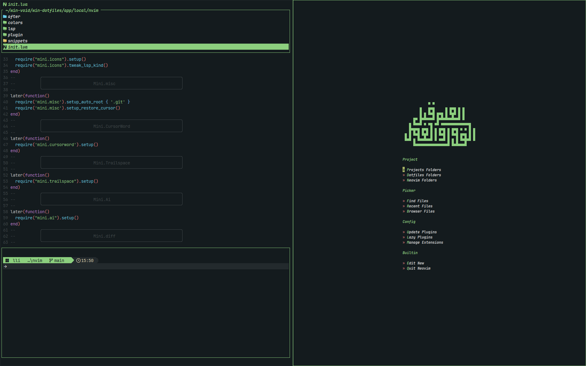

# 🚀 Neovim Void - Cosmic-Level Productivity


**A stellar Neovim config that floats in the void between minimalism and power** ✨

<div align="center">
  
  <br>
  <em>Add actual screenshot path here</em>
</div>

## 🌌 Features

### 🪐 Core Philosophy

- **Zero-bloat** All Configuration In One File
- **Lua-powered** performance
- **Batteries-included** developer experience
- **Dark matter** theme with interstellar highlights

## 󰏖 The Holy Trinity

| Plugin                                                                | Purpose                                  | Stars                                                                                |
| --------------------------------------------------------------------- | ---------------------------------------- | ------------------------------------------------------------------------------------ |
| [mini.nvim](https://github.com/echasnovski/mini.nvim)                 | Swiss-army knife for essential functions |            |
| [nvim-treesitter](https://github.com/nvim-treesitter/nvim-treesitter) | Next-level syntax highlighting           |  |
| [conform.nvim](https://github.com/stevearc/conform.nvim)              | Formatting without the fuss              |            |

## 🚀 Installation (Lightyears Ahead)

**Prerequisites**

- Neovim 0.11+
- Git 2.19+
- Nerd Font (Recommend [JetBrainsMono Nerd Font](https://github.com/ryanoasis/nerd-fonts))

**Recommend**

- fzf
- rg
- fd

**Launch Sequence**

```bash
# Clone the repository
git clone https://github.com/u-shen/neovim-void ~/.config/nvim

# Enter the event horizon
nvim
```
