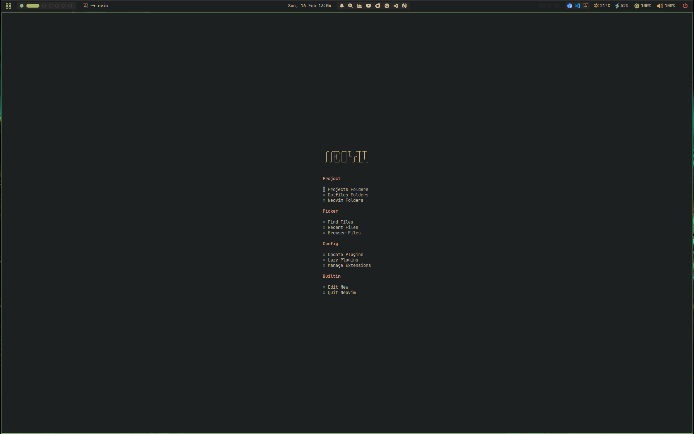
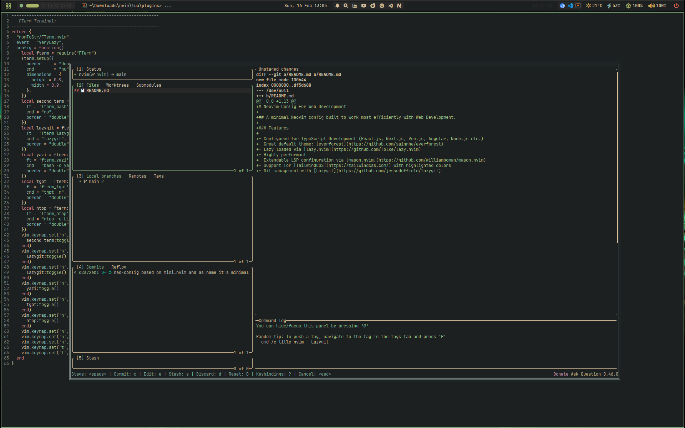
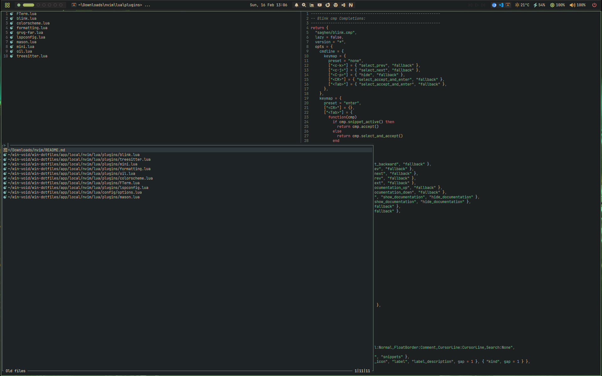

# Neovim Config For Web Development

## A minimal Neovim config built to work most efficiently with Web Development.

### Features

- Configured for TypeScript Development (React.js, Next.js, Vue.js, Angular, Node.js etc.)
- Great default theme: [everforest](https://github.com/sainnhe/everforest)
- Lazy loaded via [lazy.nvim](https://github.com/folke/lazy.nvim)
- Highly performant
- Extendable LSP configuration via [mason.nvim](https://github.com/williamboman/mason.nvim)
- Support for [TailwindCSS](https://tailwindcss.com/) with highlighted colors
- Git management with [Lazygit](https://github.com/jesseduffield/lazygit)

### Screenshot

Dashboard

Lazygit

Oil

